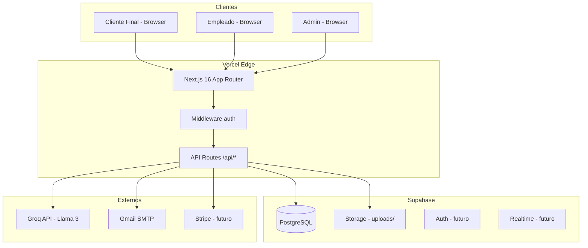
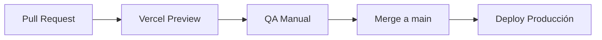
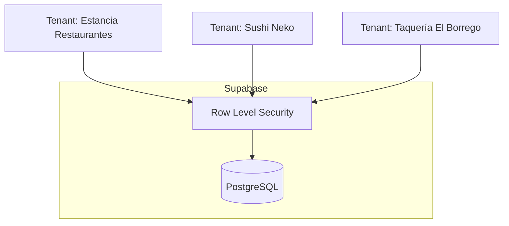
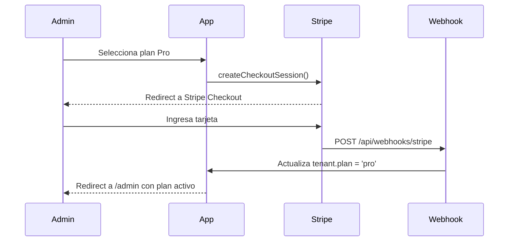
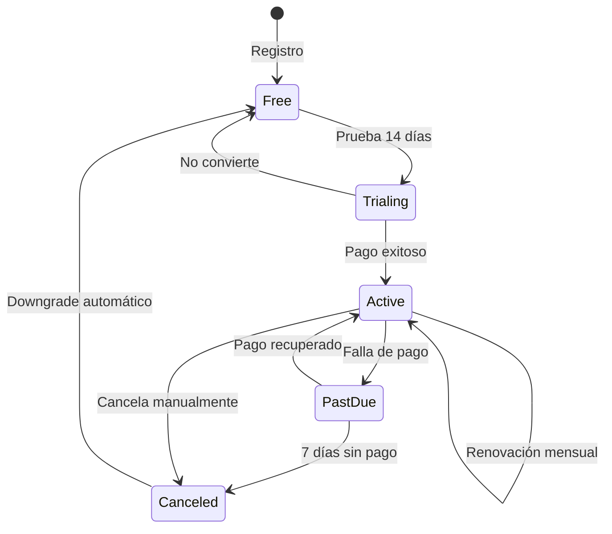
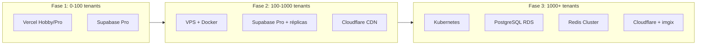
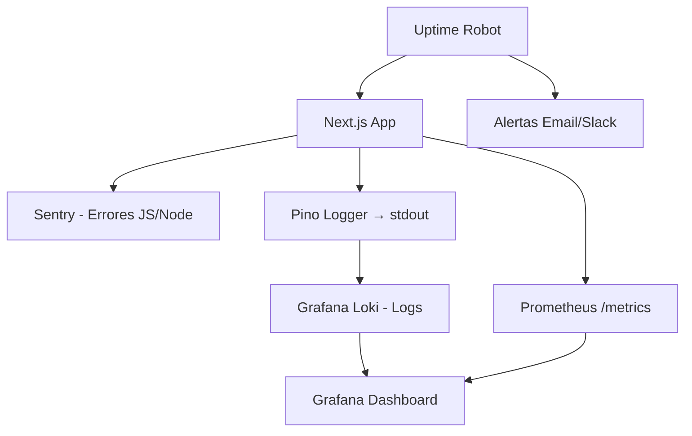

# Arquitectura SaaS — Documento Técnico Oficial
**Proyecto:** Chubis / Plataforma Restaurant SaaS  
**Fecha:** 2026-06-12  
**Versión:** 1.0  
**Autor:** Arquitecto de Software Senior / CTO  
**Stack:** Next.js 16 · React 19 · Supabase · TypeScript · Tailwind CSS 4 · Vercel

---

## 1. Estado Actual del Proyecto

### Resumen General

Chubis es una plataforma SaaS white-label para restaurantes y cafeterías. Empezó como un sistema de tarjeta de lealtad digital y ha evolucionado en un producto multi-módulo con tres audiencias distintas: clientes finales, empleados y administradores. Cada instancia puede personalizarse completamente con branding propio (nombre, logo, colores).

### Funcionalidades Actualmente Definidas

| Módulo | Estado | Audiencia |
|---|---|---|
| Tarjeta de lealtad (5 sellos → café gratis) | ✅ Producción | Cliente |
| Menú digital con categorías y likes | ✅ Producción | Cliente / Admin |
| Reseñas con alerta de reseña negativa | ✅ Producción | Cliente / Admin |
| Recetario digital (chef virtual con IA) | ✅ Producción | Cliente / Admin |
| Pantallas TV / digital signage | ✅ Producción | Admin |
| Panel de pedidos (cocina / mesero) | ✅ Producción | Empleado / Admin |
| CRM básico de clientes | ✅ Producción | Admin |
| Analytics básico | ✅ Producción | Admin |
| Sistema de reservaciones y plano de mesas | ✅ Producción | Admin |
| AI Chat por rol (cliente, cocinero, mesero, admin) | ✅ Producción | Todos |
| Configuración de branding por sección | ✅ Producción | Admin |
| Feature flags (módulos ON/OFF) | ✅ Producción | Super Admin |
| Activación de clientes por WhatsApp/SMS | ✅ Producción | Empleado |
| Upload de imágenes → WebP (browser Canvas) | ✅ Producción | Admin |
| Autenticación admin + empleado (HMAC session) | ✅ Producción | Admin / Empleado |
| Multi-tenant (white-label por tenant) | ⚠️ Parcial (1 tenant) | — |
| Sistema de pagos / suscripciones | ❌ Pendiente | — |
| Onboarding self-service | ❌ Pendiente | — |
| 2FA / OAuth | ❌ Pendiente | — |
| Notificaciones push | ❌ Pendiente | — |
| API pública documentada | ❌ Pendiente | — |

### Módulos Existentes

```
app/
├── (customer)        → /menu, /review, /resena, /recetas, /card/*, /registro, /activate, /tv
├── admin/            → Dashboard completo: analytics, marketing, CRM, menú, TV,
│                        reservaciones, tarjetas, configuración, IA chat
└── employee/         → Sellar visitas, gestión de pedidos, scanner QR

lib/
├── db.ts             → customers (legacy loyalty)
├── loyaltyDb.ts      → loyalty_cards
├── menuDb.ts         → menu_items
├── ordersDb.ts       → orders
├── recipeDb.ts       → recipes
├── reviewDb.ts       → reviews
├── tvDb.ts           → tv_slides
├── settingsDb.ts     → settings (key/value global)
├── adminDb.ts        → admins
├── employeeDb.ts     → employees
├── auth.ts           → HMAC session tokens
├── features.ts       → feature flags
└── uploadWebp.ts     → WebP conversion (browser-side)
```

### Riesgos Técnicos Identificados

| Riesgo | Severidad | Descripción | Solución Propuesta |
|---|---|---|---|
| Single tenant hardcodeado | 🔴 Alta | Todos los datos son globales, no hay `tenant_id` | Migración multi-tenant con RLS en Supabase |
| `ADMIN_SECRET` en fallback `dev-secret` | 🔴 Alta | Si no se setea en Vercel, las sesiones son forgeables | Validación obligatoria al arrancar |
| Supabase anon key expuesta en frontend | 🟡 Media | Las RLS policies son la única barrera | Implementar RLS correctamente en todas las tablas |
| Vercel Hobby 10s timeout en funciones | 🟡 Media | Las funciones de IA bordean el límite | Migrar a Edge Runtime o Vercel Pro |
| Sin rate limiting en API routes | 🟡 Media | Endpoints públicos vulnerables a abuso | Implementar middleware de rate limiting |
| Passwords con SHA-256 sin salt | 🔴 Alta | SHA-256 puro es vulnerable a rainbow tables | Migrar a bcrypt / Argon2 |
| Sin tests automatizados | 🟡 Media | No hay suite de tests configurada | Implementar Vitest + Playwright |
| localStorage para estado crítico (floor plan) | 🟢 Baja | Datos se pierden al cambiar de dispositivo | Persistir en Supabase |

---

## 2. Arquitectura General

### Vista de Alto Nivel



### Frontend

- **Framework:** Next.js 16 con App Router y webpack
- **UI:** React 19 + Tailwind CSS 4 (sin `tailwind.config.js`, usa `@theme inline {}`)
- **Canvas:** react-konva (SSR desactivado, carga dinámica con `next/dynamic`)
- **Animaciones:** lottie-react para TV signage
- **Estado:** React local state + localStorage para floor plan, TV, reservaciones
- **Theming:** CSS vars (`--ad-bg`, `--ad-accent`, etc.) controladas por `data-admin-theme`
- **Imágenes:** WebP conversion con Canvas API antes de subir a Supabase Storage

### Backend

- **API Routes:** `app/api/` — colección (`GET`/`POST`) + `[id]` (`GET`/`PATCH`/`DELETE`)
- **Módulos server-only:** `lib/*Db.ts` importan desde API routes únicamente
- **Auth middleware:** `verifySession()` en cada API route protegida
- **Streaming IA:** SSE manual via `ReadableStream` en `/api/ai/chat`
- **Email:** nodemailer + Gmail para alertas de reseña negativa

### Base de Datos

Supabase (PostgreSQL) con cliente anon-key. Esquema actual:

| Tabla | Descripción |
|---|---|
| `customers` | Clientes de lealtad legacy |
| `loyalty_cards` | Tarjetas de lealtad (modelo nuevo) |
| `menu_items` | Platillos, bebidas, etc. |
| `orders` | Pedidos con estado |
| `recipes` | Recetario |
| `reviews` | Reseñas de clientes |
| `tv_slides` | Diapositivas para pantallas |
| `settings` | Key/value de configuración global |
| `admins` | Cuentas de administrador |
| `employees` | Cuentas de empleado |

### Almacenamiento

Supabase Storage, bucket `uploads/` con prefijos por dominio:
- `menu/` — imágenes de platillos
- `tv/` — slides de TV
- `recipes/` — imágenes de recetas
- `settings/` — logos y assets de branding

### Sistema de Autenticación

```
Admin/Empleado:
  Login → POST /api/auth → verifica SHA-256(ADMIN_SECRET:name:password)
        → HMAC token "<id>.<hmac(id, ADMIN_SECRET)>"
        → Cookie httpOnly "admin_session" (+ readable "admin_name")
  
  Cada API protegida: verifySession(cookie) → extrae id del admin

Cliente:
  POST /api/customer-auth → SHA-256 password hash
  UUID en localStorage (loyalty_id / loyalty_pending_id)
```

> ⚠️ **Pendiente:** migrar a Supabase Auth para OAuth, 2FA, magic links.

### Sistema de Roles y Permisos

| Rol | Acceso | Autenticación |
|---|---|---|
| `customer` | `/menu`, `/card`, `/review`, `/recetas` | localStorage UUID |
| `employee` | `/employee/*` | Cookie `admin_session` (tipo employee) |
| `admin` | `/admin/*` | Cookie `admin_session` (tipo admin) |
| `super_admin` | Todo + feature flags | Primer admin creado (createdAt más antiguo) |

Feature flags en tabla `settings` (key `feature_flags`, JSON). El `AdminNav` muestra badge "PRO" en módulos desactivados.

---

## 3. Arquitectura de Despliegue

### Entorno de Desarrollo

**Herramientas:**
- Node.js 20 LTS
- npm (no yarn/pnpm por compatibilidad con sharp)
- VS Code + extensión Claude Code
- Git + GitKraken

**Variables de entorno (`.env.local`):**
```env
NEXT_PUBLIC_SUPABASE_URL=https://xxx.supabase.co
NEXT_PUBLIC_SUPABASE_ANON_KEY=eyJ...
ADMIN_SECRET=mi-secreto-local-seguro
GROQ_API_KEY=gsk_...
GMAIL_USER=correo@gmail.com
GMAIL_APP_PASSWORD=xxxx-xxxx-xxxx-xxxx
REVIEW_EMAIL=alertas@miempresa.com
```

**Flujo de trabajo:**
```bash
npm run dev       # servidor en localhost:3000 con hot reload
npx tsc --noEmit  # type-check sin compilar
npm run lint      # ESLint
npm run build     # build de producción local
```

**Convención de ramas:**
```
main              → producción (auto-deploy en Vercel)
develop           → integración
feature/xxx       → funcionalidades
fix/xxx           → correcciones
```

### Entorno de Staging

**Objetivo:** validar features antes de producción con datos reales anonimizados.

**Configuración recomendada:**
```
- Vercel Preview Deployments (automático en cada PR)
- Proyecto Supabase separado (staging)
- Variables de entorno de staging en Vercel
- ADMIN_SECRET diferente al de producción
- Base de datos con seed de datos de prueba
```

**Pipeline:**


### Entorno de Producción

#### Opción A — Vercel (Actual, recomendado para MVP)

```
Vercel Hobby/Pro → Next.js serverless functions
Supabase Free/Pro → PostgreSQL + Storage
Dominio propio → DNS en Cloudflare
```

**Pros:** Sin mantenimiento de servidor, deploy automático, SSL automático.  
**Contras:** Límite de 10s en funciones (Hobby), precio escala con uso.

#### Opción B — VPS + Docker + NGINX (recomendado para escala)

**Infraestructura:**
```
VPS (DigitalOcean / Hetzner / Vultr):
├── Ubuntu 22.04 LTS
├── Docker + Docker Compose
├── NGINX (reverse proxy + SSL termination)
├── Certbot (Let's Encrypt automático)
└── fail2ban + UFW
```

**`docker-compose.yml` recomendado:**
```yaml
version: '3.8'
services:
  app:
    build: .
    restart: always
    environment:
      - NODE_ENV=production
      - NEXT_PUBLIC_SUPABASE_URL=${SUPABASE_URL}
      - NEXT_PUBLIC_SUPABASE_ANON_KEY=${SUPABASE_ANON_KEY}
      - ADMIN_SECRET=${ADMIN_SECRET}
      - GROQ_API_KEY=${GROQ_API_KEY}
    ports:
      - "3000:3000"
    healthcheck:
      test: ["CMD", "curl", "-f", "http://localhost:3000/api/health"]
      interval: 30s
      retries: 3

  nginx:
    image: nginx:alpine
    restart: always
    ports:
      - "80:80"
      - "443:443"
    volumes:
      - ./nginx.conf:/etc/nginx/nginx.conf:ro
      - ./certbot/conf:/etc/letsencrypt:ro
    depends_on:
      - app
```

**`nginx.conf` base:**
```nginx
server {
    listen 443 ssl http2;
    server_name mirestaurante.com;

    ssl_certificate /etc/letsencrypt/live/mirestaurante.com/fullchain.pem;
    ssl_certificate_key /etc/letsencrypt/live/mirestaurante.com/privkey.pem;
    ssl_protocols TLSv1.2 TLSv1.3;

    location / {
        proxy_pass http://app:3000;
        proxy_http_version 1.1;
        proxy_set_header Upgrade $http_upgrade;
        proxy_set_header Connection 'upgrade';
        proxy_set_header Host $host;
        proxy_set_header X-Real-IP $remote_addr;
        proxy_cache_bypass $http_upgrade;
    }
}

server {
    listen 80;
    server_name mirestaurante.com;
    return 301 https://$host$request_uri;
}
```

**SSL con Certbot:**
```bash
certbot --nginx -d mirestaurante.com -d www.mirestaurante.com
# Renovación automática vía cron:
0 12 * * * /usr/bin/certbot renew --quiet
```

**Backups automatizados:**
```bash
# Backup diario de Supabase (via pg_dump)
0 2 * * * pg_dump $DATABASE_URL | gzip > /backups/db-$(date +%F).sql.gz
# Retención: 30 días locales + sync a S3/R2
find /backups -name "*.sql.gz" -mtime +30 -delete
```

**Monitoreo:**
```
Uptime Robot (gratuito)  → alertas si el sitio cae
Sentry                   → errores de JavaScript/Node
Grafana + Prometheus     → métricas de CPU/RAM/requests
Loki                     → agregación de logs
```

---

## 4. Base de Datos

### Diseño Actual (Supabase PostgreSQL)

```mermaid
erDiagram
    customers {
        uuid id PK
        text name
        text phone
        int stamps
        bool confirmed
        text password_hash
        timestamp created_at
        timestamp expires_at
    }
    loyalty_cards {
        uuid id PK
        text name
        text phone_normalized
        int stamps
        bool active
        timestamp expires_at
        timestamp created_at
    }
    menu_items {
        uuid id PK
        text name
        text description
        numeric price
        text category
        text image_url
        bool available
        int likes
        timestamp created_at
    }
    orders {
        uuid id PK
        text customer_name
        jsonb items
        text status
        numeric total
        text notes
        int table_number
        timestamp created_at
    }
    reviews {
        uuid id PK
        text customer_name
        int rating
        text comment
        bool bad
        bool published
        timestamp created_at
    }
    recipes {
        uuid id PK
        text name
        text description
        text category
        text[] ingredients
        text[] steps
        text image_url
        timestamp created_at
    }
    tv_slides {
        uuid id PK
        text title
        text image_url
        text link_url
        bool active
        bool is_offer
        int slide_order
        timestamp created_at
    }
    settings {
        uuid id PK
        text key UK
        text value
        timestamp updated_at
    }
    admins {
        uuid id PK
        text name UK
        text password_hash
        timestamp created_at
    }
    employees {
        uuid id PK
        text name UK
        text password_hash
        timestamp created_at
    }
```



### Índices Recomendados

```sql
-- Búsqueda de clientes por teléfono (loyalty)
CREATE INDEX idx_loyalty_cards_phone ON loyalty_cards(phone_normalized);
CREATE INDEX idx_customers_phone ON customers(phone);

-- Pedidos por estado (cocina ve activos)
CREATE INDEX idx_orders_status ON orders(status);
CREATE INDEX idx_orders_created ON orders(created_at DESC);

-- Menú por categoría y disponibilidad
CREATE INDEX idx_menu_category_available ON menu_items(category, available);

-- Settings por key (look up frecuente)
CREATE UNIQUE INDEX idx_settings_key ON settings(key);

-- Reviews por rating
CREATE INDEX idx_reviews_rating ON reviews(rating);
CREATE INDEX idx_reviews_published ON reviews(published, created_at DESC);
```

### Estrategia de Backup

| Frecuencia | Tipo | Destino | Retención |
|---|---|---|---|
| Cada hora | Supabase automático (Pro) | Supabase infraestructura | 7 días |
| Diario 2am | `pg_dump` completo | S3 / Cloudflare R2 | 30 días |
| Semanal | Snapshot completo + Storage | S3 Glacier | 1 año |
| Mensual | Full backup + verificación de restauración | Offsite | 3 años |

### Escalabilidad

```
Fase 1 (actual):  Supabase Free → hasta ~500 MAU
Fase 2 (MVP):     Supabase Pro ($25/mes) → hasta 10K MAU, 8GB DB
Fase 3 (escala):  Supabase Pro + réplicas de lectura → 100K MAU
Fase 4 (enterprise): PostgreSQL dedicado en RDS/Aurora con pgBouncer
```

### Recuperación ante Desastres (RTO/RPO)

| Escenario | RPO (pérdida de datos) | RTO (tiempo de recuperación) |
|---|---|---|
| Fallo de función Vercel | 0 | < 1 min (auto-restart) |
| Corrupción de tabla | < 1 hora (backup horario) | 30 min |
| Fallo completo de Supabase | < 24 horas (backup diario) | 2 horas |
| Pérdida total del servidor | < 24 horas | 4 horas |

---

## 5. SaaS Multiusuario

### Arquitectura Multi-Tenant

El proyecto actualmente es **single-tenant** (un restaurante). Para convertirlo en SaaS real con múltiples restaurantes independientes, se requiere la siguiente arquitectura:

#### Modelo: Shared Database, Row-Level Security (recomendado)



**Ventajas:** Costo bajo, mantenimiento simple, un solo deploy.  
**Desventajas:** Un bug de RLS puede exponer datos entre tenants (mitigado con tests).

#### Migración de Tablas

Agregar `tenant_id` a todas las tablas con relación a la tabla `tenants`:

```sql
-- Nueva tabla maestra
CREATE TABLE tenants (
    id UUID PRIMARY KEY DEFAULT gen_random_uuid(),
    slug TEXT UNIQUE NOT NULL,          -- "estancia-restaurantes"
    name TEXT NOT NULL,
    plan TEXT DEFAULT 'free',           -- free | starter | pro | enterprise
    stripe_customer_id TEXT,
    stripe_subscription_id TEXT,
    active BOOLEAN DEFAULT true,
    created_at TIMESTAMPTZ DEFAULT now()
);

-- Agregar a todas las tablas existentes
ALTER TABLE menu_items    ADD COLUMN tenant_id UUID REFERENCES tenants(id);
ALTER TABLE orders        ADD COLUMN tenant_id UUID REFERENCES tenants(id);
ALTER TABLE recipes       ADD COLUMN tenant_id UUID REFERENCES tenants(id);
ALTER TABLE reviews       ADD COLUMN tenant_id UUID REFERENCES tenants(id);
ALTER TABLE tv_slides     ADD COLUMN tenant_id UUID REFERENCES tenants(id);
ALTER TABLE settings      ADD COLUMN tenant_id UUID REFERENCES tenants(id);
ALTER TABLE admins        ADD COLUMN tenant_id UUID REFERENCES tenants(id);
ALTER TABLE employees     ADD COLUMN tenant_id UUID REFERENCES tenants(id);
ALTER TABLE loyalty_cards ADD COLUMN tenant_id UUID REFERENCES tenants(id);
ALTER TABLE customers     ADD COLUMN tenant_id UUID REFERENCES tenants(id);

-- RLS en cada tabla
ALTER TABLE menu_items ENABLE ROW LEVEL SECURITY;
CREATE POLICY "tenant_isolation" ON menu_items
    USING (tenant_id = current_setting('app.tenant_id')::UUID);
```

#### Resolución de Tenant por Dominio

```typescript
// middleware.ts
import { NextRequest, NextResponse } from 'next/server'

export async function middleware(req: NextRequest) {
  const host = req.headers.get('host') ?? ''
  // tenant por subdominio: estancia.chubis.app
  const subdomain = host.split('.')[0]
  // o por dominio propio con CNAME: mirestaurante.com → chubis.app
  const tenant = await resolveTenant(subdomain)

  const res = NextResponse.next()
  res.headers.set('x-tenant-id', tenant.id)
  res.headers.set('x-tenant-slug', tenant.slug)
  return res
}
```

### Estructura Organizacional

```
Tenant (Restaurante)
├── Admins (1..N) — acceso a /admin/*
│   └── Super Admin (el primero creado)
├── Employees (1..N) — acceso a /employee/*
└── Customers (N) — clientes de lealtad
```

### Roles y Permisos Detallados

| Permiso | Super Admin | Admin | Empleado | Cliente |
|---|---|---|---|---|
| Ver analytics | ✅ | ✅ | ❌ | ❌ |
| Editar menú | ✅ | ✅ | ❌ | ❌ |
| Sellar tarjetas | ✅ | ✅ | ✅ | ❌ |
| Ver pedidos | ✅ | ✅ | ✅ | ❌ |
| Cambiar configuración | ✅ | ✅ | ❌ | ❌ |
| Activar/desactivar módulos | ✅ | ❌ | ❌ | ❌ |
| Gestionar admins | ✅ | ❌ | ❌ | ❌ |
| Ver su propia tarjeta | ❌ | ❌ | ❌ | ✅ |

---

## 6. Sistema de Pagos

### Arquitectura con Stripe



### Planes Recomendados

| Plan | Precio/mes | Módulos | Límites |
|---|---|---|---|
| **Free** | $0 | Menú + Lealtad básica | 100 clientes, 1 admin |
| **Starter** | $19 USD | + Pedidos + Reseñas + IA básica | 500 clientes, 2 admins |
| **Pro** | $49 USD | Todo + TV + Reservaciones + IA avanzada | Ilimitado, 5 admins |
| **Enterprise** | $149 USD | Todo + API + Soporte dedicado | Multi-ubicación |

### Implementación con Stripe

```typescript
// app/api/stripe/checkout/route.ts
import Stripe from 'stripe'
const stripe = new Stripe(process.env.STRIPE_SECRET_KEY!)

export async function POST(req: Request) {
  const { planId, tenantId } = await req.json()

  const session = await stripe.checkout.sessions.create({
    mode: 'subscription',
    payment_method_types: ['card'],
    line_items: [{ price: planId, quantity: 1 }],
    metadata: { tenantId },
    success_url: `${process.env.APP_URL}/admin/billing?success=1`,
    cancel_url: `${process.env.APP_URL}/admin/billing?canceled=1`,
    // Soporte para prorrateo automático
    subscription_data: {
      proration_behavior: 'create_prorations',
    },
  })

  return Response.json({ url: session.url })
}

// app/api/webhooks/stripe/route.ts
export async function POST(req: Request) {
  const sig = req.headers.get('stripe-signature')!
  const event = stripe.webhooks.constructEvent(
    await req.text(),
    sig,
    process.env.STRIPE_WEBHOOK_SECRET!
  )

  switch (event.type) {
    case 'customer.subscription.created':
    case 'customer.subscription.updated':
      await updateTenantPlan(event.data.object)
      break
    case 'customer.subscription.deleted':
      await downgradeTenant(event.data.object.metadata.tenantId)
      break
    case 'invoice.payment_failed':
      await notifyPaymentFailed(event.data.object)
      break
  }

  return Response.json({ received: true })
}
```

### Portal de Facturación

Usar el portal de clientes de Stripe para autogestión:

```typescript
const portalSession = await stripe.billingPortal.sessions.create({
  customer: tenant.stripeCustomerId,
  return_url: `${process.env.APP_URL}/admin/billing`,
})
// El cliente puede: cambiar plan, descargar facturas, cancelar, actualizar tarjeta
```

### Ciclo de Vida de Suscripción



---

## 7. Seguridad

### Estado Actual y Mejoras Requeridas

#### Autenticación (Estado Actual)

```
ACTUAL:  SHA-256(ADMIN_SECRET:name:password) → hash comparado en DB
         Token HMAC("<id>.<hmac(id, ADMIN_SECRET)>") en cookie httpOnly

RIESGO:  SHA-256 sin salt es vulnerable a rainbow tables y ataques de diccionario
MEJORA:  Migrar a bcrypt (cost factor 12) o Argon2id
```

```typescript
// ACTUAL (inseguro)
const hash = crypto.createHash('sha256')
  .update(`${process.env.ADMIN_SECRET}:${name}:${password}`)
  .digest('hex')

// PROPUESTO (seguro)
import { hash, verify } from '@node-rs/argon2'
const passwordHash = await hash(password, {
  memoryCost: 19456,
  timeCost: 2,
  outputLen: 32,
  parallelism: 1,
})
```

#### JWT para API

```typescript
// lib/jwt.ts — tokens con expiración explícita
import { SignJWT, jwtVerify } from 'jose'
const secret = new TextEncoder().encode(process.env.JWT_SECRET)

export async function signToken(payload: Record<string, unknown>) {
  return new SignJWT(payload)
    .setProtectedHeader({ alg: 'HS256' })
    .setIssuedAt()
    .setExpirationTime('8h')
    .sign(secret)
}
```

#### OAuth con Supabase Auth (propuesto)

```typescript
// Proveedores: Google, GitHub
await supabase.auth.signInWithOAuth({
  provider: 'google',
  options: { redirectTo: `${origin}/auth/callback` }
})
```

#### 2FA (propuesto)

```typescript
// TOTP (Google Authenticator / Authy)
import * as OTPAuth from 'otpauth'

const totp = new OTPAuth.TOTP({
  issuer: 'Chubis',
  label: adminName,
  algorithm: 'SHA1',
  digits: 6,
  period: 30,
  secret: OTPAuth.Secret.fromBase32(admin.totpSecret),
})
const isValid = totp.validate({ token: userCode, window: 1 }) !== null
```

### Protección contra Ataques Comunes

| Ataque | Protección Actual | Mejora Propuesta |
|---|---|---|
| SQL Injection | ✅ Supabase parametriza queries | N/A |
| XSS | ✅ React escapa por defecto | CSP headers |
| CSRF | ⚠️ Sin protección explícita | SameSite=Strict en cookies |
| Brute Force | ❌ Sin rate limiting | Implementar con `@upstash/ratelimit` |
| DDoS | ⚠️ Solo Vercel/CDN | Cloudflare WAF |
| Path Traversal | ✅ Rutas fijas en Next.js | N/A |
| Open Redirect | ❌ Sin validación de redirects | Whitelist de URLs |

### Rate Limiting (propuesto)

```typescript
// middleware.ts
import { Ratelimit } from '@upstash/ratelimit'
import { Redis } from '@upstash/redis'

const ratelimit = new Ratelimit({
  redis: Redis.fromEnv(),
  limiter: Ratelimit.slidingWindow(10, '10 s'), // 10 req/10s por IP
})

export async function middleware(req: NextRequest) {
  if (req.nextUrl.pathname.startsWith('/api/')) {
    const ip = req.ip ?? '127.0.0.1'
    const { success } = await ratelimit.limit(ip)
    if (!success) return new Response('Too Many Requests', { status: 429 })
  }
}
```

### Gestión de Secretos

```bash
# Variables en Vercel (nunca en .env comiteado)
vercel env add ADMIN_SECRET production
vercel env add GROQ_API_KEY production
vercel env add STRIPE_SECRET_KEY production

# En VPS: usar Docker secrets o HashiCorp Vault
docker secret create admin_secret ./admin_secret.txt
```

### Headers de Seguridad

```typescript
// next.config.ts
const securityHeaders = [
  { key: 'X-DNS-Prefetch-Control', value: 'on' },
  { key: 'Strict-Transport-Security', value: 'max-age=63072000; includeSubDomains; preload' },
  { key: 'X-Frame-Options', value: 'SAMEORIGIN' },
  { key: 'X-Content-Type-Options', value: 'nosniff' },
  { key: 'Referrer-Policy', value: 'strict-origin-when-cross-origin' },
  { key: 'Permissions-Policy', value: 'camera=(), microphone=(), geolocation=()' },
]
```

---

## 8. Escalabilidad

### Estrategia por Fase



### Caché

```typescript
// Caché de settings por tenant (evita 6 queries por request)
import { unstable_cache } from 'next/cache'

export const getCachedSettings = unstable_cache(
  async (tenantId: string) => getAllSettings(tenantId),
  ['tenant-settings'],
  { revalidate: 60, tags: ['settings'] } // 1 minuto
)

// En API route al actualizar settings:
revalidateTag('settings')
```

### CDN para imágenes

```typescript
// next.config.ts — optimización automática de imágenes
const nextConfig: NextConfig = {
  images: {
    remotePatterns: [
      { protocol: 'https', hostname: '*.supabase.co' },
    ],
    formats: ['image/avif', 'image/webp'],
  },
}

// En componentes: usar <Image> de next/image
import Image from 'next/image'
<Image src={item.imageUrl} width={400} height={300} alt={item.name} />
```

### Optimización de Queries

```sql
-- Evitar N+1 en pedidos con items
-- ACTUAL (N+1): orders.items es un JSONB, sin N+1
-- FUTURO con multi-tenant: agregar índice parcial por estado activo
CREATE INDEX idx_orders_active ON orders(tenant_id, created_at DESC)
WHERE status NOT IN ('delivered', 'cancelled');

-- Paginación eficiente con cursor en lugar de OFFSET
SELECT * FROM menu_items
WHERE tenant_id = $1 AND id > $cursor
ORDER BY created_at DESC
LIMIT 20;
```

### Escalabilidad Horizontal con Vercel

```
Vercel Functions escalan automáticamente (serverless).
Cada request = función independiente.
Cold starts: mitigados con Edge Runtime para rutas críticas.
```

---

## 9. Operación y Soporte

### Stack de Observabilidad



### Métricas Clave (KPIs Técnicos)

| Métrica | Umbral Normal | Alerta |
|---|---|---|
| Tiempo de respuesta P95 | < 500ms | > 2s |
| Error rate (5xx) | < 0.1% | > 1% |
| Uptime mensual | > 99.9% | < 99.5% |
| Cold start de functions | < 800ms | > 2s |
| Latencia de DB queries | < 100ms | > 500ms |
| Uso de CPU (VPS) | < 60% | > 85% |
| Uso de RAM (VPS) | < 70% | > 90% |
| Tamaño de DB | — | > 80% del límite |

### Gestión de Incidencias

```
Nivel 1 (P1 - Crítico): Sitio caído o datos corruptos
  → Respuesta: < 15 min
  → Canal: PagerDuty / llamada directa
  → Rollback inmediato si fue un deploy

Nivel 2 (P2 - Alto): Función crítica no funciona (pagos, auth)
  → Respuesta: < 1 hora
  → Canal: Slack #incidents

Nivel 3 (P3 - Medio): Feature degradada, no crítico
  → Respuesta: < 24 horas
  → Canal: Jira / Linear

Nivel 4 (P4 - Bajo): Mejora de UX, bug menor
  → Respuesta: próximo sprint
```

### Runbook de Rollback

```bash
# Vercel: rollback a deployment anterior
vercel rollback [deployment-url]

# VPS + Docker:
docker-compose down
docker pull myapp:previous-tag
docker-compose up -d

# Base de datos: nunca rollback en producción sin backup verificado
pg_restore -d $DATABASE_URL backup-2026-06-11.sql.gz
```

---

## 10. Roadmap de Lanzamiento

### MVP (0-3 meses) — Salir al mercado con el primer cliente de pago

**Objetivo:** Un restaurante real pagando $19/mes con funcionalidades básicas.

- [ ] Implementar `tenant_id` en todas las tablas + RLS básico
- [ ] Onboarding self-service (registro de restaurante + primer admin)
- [ ] Integración básica con Stripe (plan Starter)
- [ ] Migrar passwords a bcrypt/Argon2
- [ ] Rate limiting en endpoints públicos
- [ ] Dominio propio por tenant (subdomain routing)
- [ ] Health check endpoint `/api/health`
- [ ] Logging estructurado con Pino
- [ ] Monitoring básico con Uptime Robot + Sentry

**Stack adicional necesario:** Stripe, @upstash/ratelimit, bcrypt, Pino

### Versión 1.0 (3-6 meses) — Producto comercial estable

- [ ] Sistema multi-tenant completo con RLS en Supabase
- [ ] Portal de billing (Stripe Customer Portal)
- [ ] Página de pricing pública
- [ ] OAuth (Google) via Supabase Auth
- [ ] 2FA con TOTP para admins
- [ ] Notificaciones push (Web Push API)
- [ ] Reportes exportables (PDF/Excel)
- [ ] API pública documentada con Swagger/OpenAPI
- [ ] Tests E2E con Playwright (golden paths)
- [ ] CI/CD completo (GitHub Actions → Vercel)
- [ ] Documentación de usuario (Gitbook / Notion público)
- [ ] Soporte por chat (Crisp / Intercom)

### Versión 2.0 (6-12 meses) — Escala y automatización

- [ ] Multi-ubicación por tenant (cadenas de restaurantes)
- [ ] Integración con POS (Square, Clip, Conekta)
- [ ] Integración con delivery (Rappi, Uber Eats) vía webhooks
- [ ] Automatizaciones de marketing (email + WhatsApp)
- [ ] Programa de referidos con comisiones
- [ ] App móvil (React Native / Expo) para empleados
- [ ] Migracion a VPS + Docker para tenants Enterprise
- [ ] CDN para imágenes con transformaciones (imgix / Cloudinary)
- [ ] Analytics avanzado con dashboards por tenant
- [ ] Marketplace de plantillas de menú y branding

### Versión 3.0 (12-24 meses) — Funciones avanzadas e IA

- [ ] IA generativa para crear menús y descripciones
- [ ] Predicción de demanda con ML (qué preparar cada día)
- [ ] Precios dinámicos basados en hora/demanda
- [ ] Chatbot de WhatsApp con pedidos automáticos (Twilio + IA)
- [ ] Reconocimiento de voz para pedidos en cocina
- [ ] Análisis de sentimiento en reseñas en tiempo real
- [ ] Recomendaciones personalizadas por cliente (collaborative filtering)
- [ ] Integración con sistemas de contabilidad (SAP, CONTPAQi)
- [ ] White-label completo para agencias (reventa a terceros)
- [ ] Soporte multi-idioma (i18n completo)

---

## 11. Costos Estimados

### Escenario: 10 tenants activos (MVP)

| Servicio | Proveedor | Plan | Costo/mes USD |
|---|---|---|---|
| Hosting (serverless) | Vercel Pro | Pro | $20 |
| Base de datos | Supabase Pro | Pro | $25 |
| Almacenamiento | Supabase Storage | Incluido en Pro (100GB) | $0 |
| CDN / DNS | Cloudflare | Free | $0 |
| IA (Groq) | Groq | Pay per token (~100K tokens/día) | ~$5 |
| Email transaccional | Resend / SendGrid | Free (3K/mes) | $0 |
| Dominio | Namecheap | — | $1.50 |
| SSL | Let's Encrypt / Vercel | Automático | $0 |
| Monitoreo | Sentry Free + Uptime Robot | Free | $0 |
| Pagos | Stripe | 2.9% + $0.30 por transacción | Variable |
| **Total fijo** | | | **~$51.50/mes** |

### Escenario: 100 tenants activos (Crecimiento)

| Servicio | Plan | Costo/mes USD |
|---|---|---|
| Vercel Pro | Pro | $20 |
| Supabase Pro | Pro + réplica lectura | $75 |
| Almacenamiento (500GB extra) | Supabase | $50 |
| Groq API | ~1M tokens/día | ~$50 |
| Resend | Pro (50K emails/mes) | $20 |
| Cloudflare Pro (WAF) | Pro | $20 |
| Sentry Team | Team | $26 |
| Backups S3/R2 | Cloudflare R2 (10GB) | $5 |
| **Total** | | **~$266/mes** |

### Punto de Equilibrio

```
Costos fijos MVP:     $52/mes
Plan Starter:         $19/usuario/mes
Margen bruto:         ~70% (después de Stripe 2.9%)

Break-even:           52 / (19 × 0.70) = ~4 tenants activos
Rentabilidad con 10:  (10 × 19 × 0.70) - 52 = $81/mes
Rentabilidad con 50:  (50 × 19 × 0.70) - 266 = $399/mes
```

---

## 12. Checklist de Producción

### Seguridad

- [ ] `ADMIN_SECRET` configurado (mínimo 32 caracteres aleatorios)
- [ ] `GROQ_API_KEY` configurado en Vercel environment
- [ ] `STRIPE_SECRET_KEY` y `STRIPE_WEBHOOK_SECRET` configurados
- [ ] Passwords de admins migrados a Argon2/bcrypt
- [ ] Rate limiting activo en endpoints públicos (`/api/ai/chat`, `/api/auth`)
- [ ] CORS configurado para solo permitir dominios propios
- [ ] Headers de seguridad (HSTS, X-Frame-Options, CSP) activos
- [ ] Stripe webhook verificado con firma
- [ ] Supabase RLS habilitado en todas las tablas de producción
- [ ] Variables secretas NUNCA en el repositorio git

### Base de Datos

- [ ] Índices creados en columnas de búsqueda frecuente
- [ ] Backup automático configurado y probado
- [ ] Restauración de backup verificada (¡probar el restore, no solo el backup!)
- [ ] Supabase Pro activado (para Point-in-Time Recovery)
- [ ] Pool de conexiones configurado (PgBouncer en Supabase)

### Infraestructura

- [ ] SSL/TLS activo en todos los dominios
- [ ] Redirección HTTP → HTTPS forzada
- [ ] Dominio personalizado configurado en Vercel
- [ ] Health check endpoint `/api/health` funcionando
- [ ] Alertas de uptime configuradas (Uptime Robot o similar)
- [ ] Error tracking configurado (Sentry)
- [ ] Logs accesibles y con retención mínima 30 días

### Funcionalidades

- [ ] Flujo completo de registro de cliente probado de extremo a extremo
- [ ] Flujo de pago con Stripe probado en modo test
- [ ] Subida de imágenes funcionando en producción
- [ ] IA respondiendo sin timeouts en producción
- [ ] QR de tienda generado y escaneable
- [ ] QR de cliente escaneable por el empleado
- [ ] Email de reseña negativa llegando correctamente
- [ ] TV signage funcionando a tiempo real

### Legal y Compliance

- [ ] Política de Privacidad publicada
- [ ] Términos y Condiciones publicados
- [ ] Aviso de cookies (GDPR/LGPD si aplica)
- [ ] Datos de clientes en servidores dentro de jurisdicción correcta
- [ ] Proceso de eliminación de cuenta documentado

### Performance

- [ ] Lighthouse score > 80 en móvil
- [ ] First Contentful Paint < 2s
- [ ] API responses < 500ms P95
- [ ] Imágenes optimizadas (WebP, tamaños correctos)
- [ ] Bundle de JavaScript analizado (`next build --profile`)

### Negocio

- [ ] Página de precios publicada
- [ ] Proceso de onboarding documentado
- [ ] Email de bienvenida automático configurado
- [ ] Soporte por chat o email disponible
- [ ] Proceso de cancelación claro para el usuario
- [ ] Métricas de negocio (MRR, churn, CAC) siendo medidas

---

## 13. Recomendaciones del CTO

### Decisiones Estratégicas para los Próximos 3 Años

#### 1. No construyas lo que puedes comprar

El mayor riesgo en etapa early es reinventar la rueda. Usa servicios gestionados para todo lo no diferenciador:

```
✅ Stripe para pagos (no construyas tu propia pasarela)
✅ Supabase Auth para autenticación (no tu propio sistema de tokens)
✅ Resend/Postmark para emails transaccionales
✅ Groq para IA (no fine-tuning propio hasta tener 10K usuarios)
✅ Vercel para deploy (no DevOps propio hasta 50 tenants)
```

#### 2. La deuda técnica más urgente: seguridad de passwords

Los passwords actuales con `SHA-256(secret:name:password)` son el mayor riesgo. Si alguien obtiene la base de datos, puede crackear todos los passwords con una GPU en horas. **Esto debe arreglarse antes de tener clientes de pago.**

```bash
# Prioridad 1: migrar a Argon2id
npm install @node-rs/argon2
# Migración con doble hash temporal:
# 1. Al siguiente login exitoso, re-hashear con Argon2
# 2. Después de 30 días, invalidar cuentas sin migrar
```

#### 3. Arquitectura multi-tenant desde el día 1

El costo de agregar `tenant_id` ahora es de 2-3 días. El costo de hacerlo cuando tienes 50 tenants y datos reales es de 2-3 semanas con riesgo de pérdida de datos. **Hazlo antes de onboardear el primer cliente real.**

#### 4. Apuesta por Edge Runtime para la IA

El límite de 10s en Vercel Hobby es un techo de cristal para la IA. Edge Runtime:
- No tiene límite de 10s (30s para streaming)
- Tiene cold starts mínimos (~5ms vs ~500ms en Node.js)
- Es globalmente distribuido

```typescript
// app/api/ai/chat/route.ts
export const runtime = 'edge'
// Requiere validar que las importaciones sean Edge-compatible
```

#### 5. Métricas de negocio desde el primer día

Instala PostHog o Mixpanel antes de onboardear clientes. Las decisiones de producto sin datos son apuestas. Lo mínimo:

```typescript
// Eventos a trackear desde el primer día:
posthog.capture('menu_viewed', { tenantId, itemCount })
posthog.capture('order_placed', { tenantId, total, itemCount })
posthog.capture('loyalty_stamp_added', { tenantId })
posthog.capture('review_submitted', { tenantId, rating })
posthog.capture('ai_message_sent', { tenantId, role })
```

#### 6. El moat competitivo está en los datos y la IA

En 18 meses, todos los competidores tendrán menú digital y pedidos. Tu ventaja defensible son:
1. **Los datos de comportamiento del cliente** (qué come, cuándo, qué pide)
2. **La IA entrenada con esos datos** (predicción de demanda, recomendaciones personalizadas)
3. **El tiempo de adopción** (los restaurantes no cambian de software fácilmente)

Invierte en almacenar eventos desde el principio, aunque no los uses hoy.

#### 7. Estrategia de pricing: freemium con límites de valor, no de funciones

```
❌ Malo:  "El plan Free no tiene IA"  (la IA es un diferenciador, bloquearla aleja usuarios)
✅ Bueno: "El plan Free tiene IA con 50 mensajes/mes"  (genera dependencia, upgrade natural)

❌ Malo:  "El plan Free no tiene analytics"
✅ Bueno: "El plan Free tiene analytics de los últimos 7 días" (los quieren ver más → upgrade)
```

#### 8. El soporte es ventas disfrazado

En B2B SaaS para restaurantes, el dueño del restaurante que llama con un problema es 10 veces más probable de hacer upgrade si lo ayudas rápido. Responde en < 2 horas durante el primer año. Cada conversación de soporte es una oportunidad de entender el producto.

#### 9. Lanza imperfecto, itera rápido

```
Semana 1-4:   Onboarding manual (tú configuras el primer restaurante)
Semana 4-8:   Onboarding semi-automático (formulario + tú revisas)
Semana 8+:    Onboarding completamente automático

No esperes a tener el onboarding perfecto para conseguir el primer cliente.
El primer cliente te va a enseñar más que 3 meses de desarrollo.
```

#### 10. Arquitectura de features: toggles, no forks

Usa el sistema de feature flags actual para nuevas funcionalidades **en desarrollo**. Esto permite:
- Desarrollar en main sin afectar producción
- Testear con un subconjunto de tenants antes del rollout global
- Rollback instantáneo si algo falla

```typescript
// Nuevo feature en desarrollo: siempre detrás de un flag
if (features.whatsappOrders) {
  return <WhatsAppOrdersPanel />
}
```

### Tabla de Decisiones Técnicas Críticas

| Decisión | Opción A | Opción B | Recomendación CTO |
|---|---|---|---|
| Auth | HMAC propio | Supabase Auth | **Supabase Auth** (OAuth, 2FA gratis) |
| Passwords | SHA-256 (actual) | Argon2id | **Argon2id** inmediatamente |
| Multi-tenant | Shared DB + RLS | DB por tenant | **Shared DB + RLS** (más económico en escala) |
| Pagos | Implementación propia | Stripe | **Stripe** (sin discusión) |
| Deploy | Vercel (actual) | VPS Docker | **Vercel** hasta 100 tenants, luego VPS |
| IA | Groq (actual) | OpenAI | **Groq** (más rápido y barato para respuestas cortas) |
| Imágenes | Supabase Storage (actual) | Cloudinary | **Supabase** hasta 500GB, luego Cloudinary |
| Email | Gmail (actual) | Resend | **Resend** ($0 hasta 3K/mes, API limpia) |
| Tests | Sin tests (actual) | Vitest + Playwright | **Playwright** para E2E críticos primero |
| Analytics de producto | Sin analytics | PostHog | **PostHog** Free (self-hosted si privacidad crítica) |

---

*Documento generado el 2026-06-12 para el proyecto Chubis / Restaurant SaaS Platform.*  
*Stack: Next.js 16 · React 19 · Supabase · TypeScript · Tailwind CSS 4 · Groq AI · Vercel*
